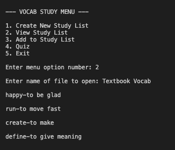
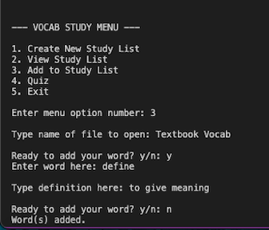
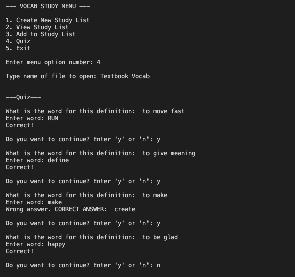
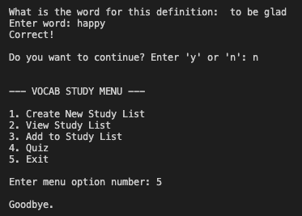

# Vocab Study List & Quiz

This is a Study Quiz program created for an intro course. The program allows the user to add and store vocabulary words which they then can use the quiz portion to test themselves. There are functions still being added to it as we continue to learn more about programming, but it work as is.

The program will create a text file that stores the user's word and definition's inputs. They can then look up the name of the file to view what was saved or generate the quiz. Each option besides #5. "Exit," will request a file name. With that said, the program is okay with spaces in the file name (ex. Data Structures or Intro to Linguistics).

## Authors

- [@mpage882](https://github.com/mpage882)
- [@cpage2](https://github.com/cpage2)

## Installation

To run this program, download the code file and open it in your Python IDE of choice.

## Acknowledgements

 - [StackOverflow (used for temp_dict())](https://stackoverflow.com/questions/35516096/reading-a-file-and-storing-contents-into-a-dictionary-python)
 - [StackOverflow (used for studyQuiz())](https://stackoverflow.com/questions/20554326/using-a-dictionary-for-a-quiz)
 - [Awesome Readme Templates](https://awesomeopensource.com/project/elangosundar/awesome-README-templates)
 - [Awesome README](https://github.com/matiassingers/awesome-readme)
 - [How to write a Good readme](https://bulldogjob.com/news/449-how-to-write-a-good-readme-for-your-github-project)

## Screenshots

